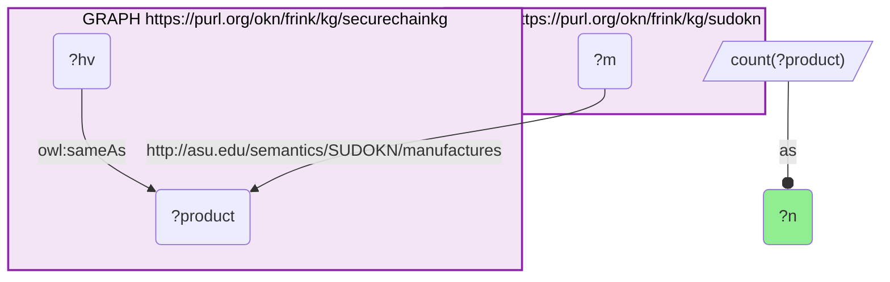
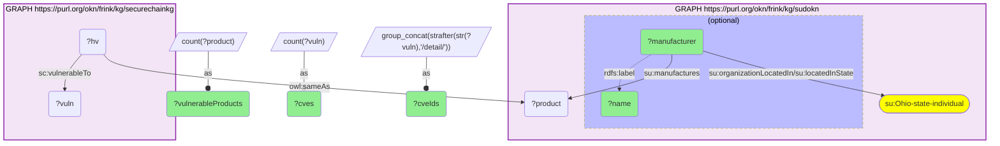
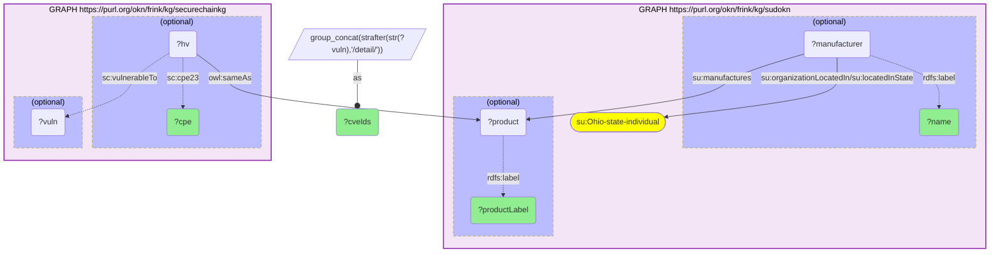

# I07-Q1: Ohio manufacturers whose products carry known vulnerabilities (securechainkg × sudokn, product identity)

- **Date:** 2026-10-02
- **Model:** claude-opus-5-5
- **SPARQL endpoint:** https://apps.okn.us/federation/sparql
- **Generated by:** mcp-okn v0.1.0 (build 6af99c9)
- **Contents:** 3 queries · 3 query diagrams

## Knowledge graphs used

- `securechainkg` — <https://purl.org/okn/frink/kg/securechainkg>
- `sudokn` — <https://purl.org/okn/frink/kg/sudokn>

## Conversation

👤 **User**

Crosswalk: securechainkg × sudokn on product identity (I4). securechainkg asserts `owl:sameAs` from its `sc:HardwareVersion` nodes onto SUDOKN product IRIs — byte-identical, no normalization — and SUDOKN reaches the manufacturer through `sudokn:manufactures`. Until this crosswalk the pair joined only at the industry grain (NAICS, I1; industry sector, I2), which can say "manufacturers in the same industry as firms with CVEs" but never "this manufacturer's product has this CVE".

Research question: which manufacturers in Ohio make products with known vulnerabilities?

---

🧠 **Assistant**

**One Ohio manufacturer: Novatech, Inc.** Six of its products carry the same two CVEs.

| Product (SUDOKN label) | CPE 2.3 (securechainkg) | CVEs |
|---|---|---|
| Orion5 DNP Master v1.27.38 | `cpe:2.3:h:novatech:orion5_dnp_master:1.27.38` | CVE-2013-2821, CVE-2013-2822 |
| Orion5 DNP Slave v1.23.10 | `cpe:2.3:h:novatech:orion5_dnp_slave:1.23.10` | CVE-2013-2821, CVE-2013-2822 |
| Orion5r DNP Master v1.27.38 | `cpe:2.3:h:novatech:orion5r_dnp_master:1.27.38` | CVE-2013-2821, CVE-2013-2822 |
| Orion5r DNP Slave v1.23.10 | `cpe:2.3:h:novatech:orion5r_dnp_slave:1.23.10` | CVE-2013-2821, CVE-2013-2822 |
| OrionLX DNP Master v1.27.38 | `cpe:2.3:h:novatech:orionlx_dnp_master:1.27.38` | CVE-2013-2821, CVE-2013-2822 |
| OrionLX DNP Slave v1.23.10 | `cpe:2.3:h:novatech:orionlx_dnp_slave:1.23.10` | CVE-2013-2821, CVE-2013-2822 |

**How the join runs.** Query 1 is the crosswalk's stored skeleton. It still reproduces the verified 17,644 SUDOKN products that securechainkg links to by `owl:sameAs`, so the bridge is live. Query 2 adds the payload on each side. On the SUDOKN side that is the manufacturer's state, reached through `organizationLocatedIn/locatedInState`; SUDOKN does not put the state on the company node itself. On the securechainkg side it is `sc:vulnerableTo`. Ohio returns exactly one manufacturer. Query 3 lists that firm's linked products with OPTIONAL vulnerabilities. Novatech is the *only* Ohio manufacturer on the bridge at all, and all six of its linked products are vulnerable. So the answer is not one firm picked out of many clean ones.

**Why the product grain matters.** The two CVEs sit on Novatech's Orion DNP3 master and slave firmware, which is grid / SCADA substation automation equipment. The industry-grain crosswalks cannot surface this. They match NAICS codes, so they return every Ohio firm in an industry where *some* company has a CVE, and nothing ties a specific firm to a specific vulnerability. The product join does.

**Caveat on the link itself.** securechainkg mints its HardwareVersion IRIs as Google search URLs keyed on the model name (e.g. `https://www.google.com/search?q=wm3300+*`). A generic model name can therefore link one HardwareVersion to products from several vendors. Across the whole bridge this happens on 10 nodes, and 5 of those carry CVEs (`apq8084`, `msm8974`, `ddr4_sdram`, `lpddr4`, and a literal `-`). It does not affect this answer: every Novatech product here has its own vendor-prefixed CPE.

## SPARQL queries executed

#### Query 1

_2026-10-02T19:57:22+00:00 · `securechainkg`, `sudokn`_

```sparql
SELECT (COUNT(DISTINCT ?product) AS ?n) WHERE {
  GRAPH <https://purl.org/okn/frink/kg/securechainkg> {
    ?hv <http://www.w3.org/2002/07/owl#sameAs> ?product .
  }
  GRAPH <https://purl.org/okn/frink/kg/sudokn> {
    ?m <http://asu.edu/semantics/SUDOKN/manufactures> ?product .
  }
}
```



_1 row(s)_

| n |
| --- |
| 17644 |

#### Query 2

_2026-10-02T19:57:23+00:00 · `sudokn`, `securechainkg`_

```sparql
PREFIX owl: <http://www.w3.org/2002/07/owl#>
PREFIX rdfs: <http://www.w3.org/2000/01/rdf-schema#>
PREFIX su: <http://asu.edu/semantics/SUDOKN/>
PREFIX sc: <https://w3id.org/secure-chain/>
SELECT ?manufacturer ?name (COUNT(DISTINCT ?product) AS ?vulnerableProducts) (COUNT(DISTINCT ?vuln) AS ?cves)
       (GROUP_CONCAT(DISTINCT STRAFTER(STR(?vuln), "/detail/"); separator=", ") AS ?cveIds)
WHERE {
  GRAPH <https://purl.org/okn/frink/kg/sudokn> {
    ?manufacturer su:organizationLocatedIn/su:locatedInState su:Ohio-state-individual ;
                  su:manufactures ?product .
    OPTIONAL { ?manufacturer rdfs:label ?name }
  }
  GRAPH <https://purl.org/okn/frink/kg/securechainkg> {
    ?hv owl:sameAs ?product ;
        sc:vulnerableTo ?vuln .
  }
}
GROUP BY ?manufacturer ?name
ORDER BY DESC(?cves)
```



_1 row(s)_

| manufacturer | name | vulnerableProducts | cves | cveIds |
| --- | --- | --- | --- | --- |
| http://asu.edu/semantics/SUDOKN/novatech.com-company-instance | Novatech, Inc. | 6 | 2 | CVE-2013-2821, CVE-2013-2822 |

#### Query 3

_2026-10-02T19:57:33+00:00 · `sudokn`, `securechainkg`_

```sparql
PREFIX owl: <http://www.w3.org/2002/07/owl#>
PREFIX rdfs: <http://www.w3.org/2000/01/rdf-schema#>
PREFIX su: <http://asu.edu/semantics/SUDOKN/>
PREFIX sc: <https://w3id.org/secure-chain/>
SELECT ?name ?productLabel ?cpe (GROUP_CONCAT(DISTINCT STRAFTER(STR(?vuln), "/detail/"); separator=", ") AS ?cveIds)
WHERE {
  GRAPH <https://purl.org/okn/frink/kg/sudokn> {
    ?manufacturer su:organizationLocatedIn/su:locatedInState su:Ohio-state-individual ;
                  su:manufactures ?product .
    OPTIONAL { ?manufacturer rdfs:label ?name }
    OPTIONAL { ?product rdfs:label ?productLabel }
  }
  GRAPH <https://purl.org/okn/frink/kg/securechainkg> {
    ?hv owl:sameAs ?product .
    OPTIONAL { ?hv sc:cpe23 ?cpe }
    OPTIONAL { ?hv sc:vulnerableTo ?vuln }
  }
}
GROUP BY ?name ?productLabel ?cpe
ORDER BY ?name ?productLabel
```



_6 row(s) — showing first 5_

| name | productLabel | cpe | cveIds |
| --- | --- | --- | --- |
| Novatech, Inc. | Orion5 DNP Master v1.27.38 | cpe:2.3:h:novatech:orion5_dnp_master:1.27.38:\*:\*:\*:\*:\*:\*:\* | CVE-2013-2821, CVE-2013-2822 |
| Novatech, Inc. | Orion5 DNP Slave v1.23.10 | cpe:2.3:h:novatech:orion5_dnp_slave:1.23.10:\*:\*:\*:\*:\*:\*:\* | CVE-2013-2822, CVE-2013-2821 |
| Novatech, Inc. | Orion5r DNP Master v1.27.38 | cpe:2.3:h:novatech:orion5r_dnp_master:1.27.38:\*:\*:\*:\*:\*:\*:\* | CVE-2013-2821, CVE-2013-2822 |
| Novatech, Inc. | Orion5r DNP Slave v1.23.10 | cpe:2.3:h:novatech:orion5r_dnp_slave:1.23.10:\*:\*:\*:\*:\*:\*:\* | CVE-2013-2821, CVE-2013-2822 |
| Novatech, Inc. | OrionLX DNP Master v1.27.38 | cpe:2.3:h:novatech:orionlx_dnp_master:1.27.38:\*:\*:\*:\*:\*:\*:\* | CVE-2013-2821, CVE-2013-2822 |
