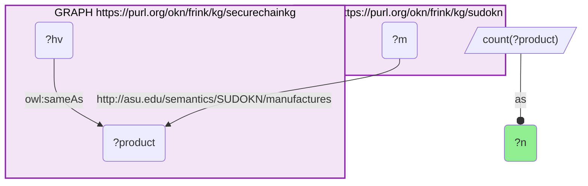
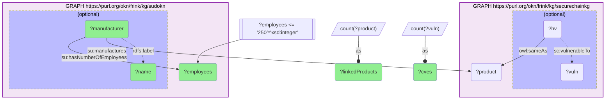

# I07-Q2: Small manufacturers (≤250 employees) ranked by recorded vulnerabilities in their products (securechainkg × sudokn, product identity)

- **Date:** 2026-10-02
- **Model:** claude-opus-5-5
- **SPARQL endpoint:** https://apps.okn.us/federation/sparql
- **Generated by:** mcp-okn v0.1.0 (build 6af99c9)
- **Contents:** 2 queries · 2 query diagrams

## Knowledge graphs used

- `securechainkg` — <https://purl.org/okn/frink/kg/securechainkg>
- `sudokn` — <https://purl.org/okn/frink/kg/sudokn>

## Conversation

👤 **User**

Crosswalk: securechainkg × sudokn on product identity (I4). securechainkg links its `sc:HardwareVersion` nodes to SUDOKN product IRIs by `owl:sameAs`. SUDOKN supplies the firm behind each product (`sudokn:manufactures`) and its size (`sudokn:hasNumberOfEmployees`). securechainkg supplies the vulnerabilities (`sc:vulnerableTo`).

Research question: among small businesses (no more than 250 employees) whose products SecureChain tracks, which carry the most recorded vulnerabilities, and which carry none?

---

🧠 **Assistant**

**66 small manufacturers have products on the bridge. Only 10 carry any recorded vulnerability; 56 carry none.**

Small manufacturers with at least one CVE on a linked product:

| Manufacturer (SUDOKN) | Employees | Linked products | Distinct CVEs |
|---|---|---|---|
| OptiLink Network | 68 | 1 | 12 |
| Robert Bosch GmbH / "Bosch" (one IRI, two labels) | 120 | 180 | 2 |
| Seowon Intech Co., Ltd. | 126 | 12 | 2 |
| Novatech, Inc. | 60 | 6 | 2 |
| Ricon Mobile | 76 | 3 | 2 |
| Arbiter Systems, Inc. | 16 | 2 | 2 |
| QEI, Inc. | 101 | 1 | 2 |
| HostEng | 30 | 7 | 1 |
| Castlenet Technologies, Inc. | 129 | 4 | 1 |
| MplusTec | 31 | 1 | 1 |

The zero-CVE tier is most of the list. The firms with the most linked products and still no CVE are Chiyu Technology (19 products), Nadatel (18), Neutron (17), Time Tools (10), Biges Technologies (9), ATop Technology (7), Systrome, KB Device and Silex Technology (6 each), then Coship Electronics (231 employees), Dasan Networks (157), FSI Technologies and Tek Microsystems (5 each).

**How the join runs.** Query 1 is the crosswalk's stored skeleton and still returns the verified 17,644 shared products. Query 2 reuses that join. It takes the employee count from the SUDOKN side, keeps firms with 250 employees or fewer, and counts `sc:vulnerableTo` under OPTIONAL. Without the OPTIONAL, the zero-vulnerability firms would drop out of the result instead of being counted at 0. The query returns 68 rows, which are 66 distinct manufacturers: Bosch and Silex Technology each carry two `rdfs:label` values.

**Reading the result.** OptiLink Network stands out: 12 CVEs on a single linked product. Most small firms, by contrast, have no vulnerability recorded on any of their linked products. That says the NVD has no CVE recorded against those hardware CPEs. It does not say the products are secure. A small vendor's hardware is less likely to be researched and assigned CVEs at all.

**Two data-quality notes.** (1) SUDOKN records Robert Bosch GmbH at 120 employees. That is clearly not the multinational's headcount, so the ≤250 filter takes the number on trust; check it before making any per-firm claim. (2) securechainkg mints HardwareVersion IRIs as Google search URLs on the model name. A generic model name can therefore link one HardwareVersion to more than one vendor's product. One such node, `lt400`, links Cudy and Cuby, but it carries no CVE, so it does not move any count in the table above.

**On the original phrasing.** This crosswalk was proposed with the question "which small business produces *modems* with the fewest vulnerabilities?", answered with Coship and Dasan tied at zero. Both firms do appear here at zero. But neither graph labels their products as modems: SUDOKN's product labels are model numbers ("Coship RT3050", "DASAN Networks H660GW"), and neither firm has a NAICS code or product category in SUDOKN. So a "modem" filter cannot be expressed against the data, and the question is asked here over all small manufacturers instead.

## SPARQL queries executed

#### Query 1

_2026-10-02T20:04:15+00:00 · `securechainkg`, `sudokn`_

```sparql
SELECT (COUNT(DISTINCT ?product) AS ?n) WHERE {
  GRAPH <https://purl.org/okn/frink/kg/securechainkg> {
    ?hv <http://www.w3.org/2002/07/owl#sameAs> ?product .
  }
  GRAPH <https://purl.org/okn/frink/kg/sudokn> {
    ?m <http://asu.edu/semantics/SUDOKN/manufactures> ?product .
  }
}
```



_1 row(s)_

| n |
| --- |
| 17644 |

#### Query 2

_2026-10-02T20:04:17+00:00 · `securechainkg`, `sudokn`_

```sparql
PREFIX owl: <http://www.w3.org/2002/07/owl#>
PREFIX rdfs: <http://www.w3.org/2000/01/rdf-schema#>
PREFIX su: <http://asu.edu/semantics/SUDOKN/>
PREFIX sc: <https://w3id.org/secure-chain/>
SELECT ?manufacturer ?name ?employees (COUNT(DISTINCT ?product) AS ?linkedProducts) (COUNT(DISTINCT ?vuln) AS ?cves)
WHERE {
  GRAPH <https://purl.org/okn/frink/kg/securechainkg> {
    ?hv owl:sameAs ?product .
    OPTIONAL { ?hv sc:vulnerableTo ?vuln }
  }
  GRAPH <https://purl.org/okn/frink/kg/sudokn> {
    ?manufacturer su:manufactures ?product ;
                  su:hasNumberOfEmployees ?employees .
    OPTIONAL { ?manufacturer rdfs:label ?name }
  }
  FILTER(?employees <= 250)
}
GROUP BY ?manufacturer ?name ?employees
ORDER BY DESC(?cves) DESC(?linkedProducts)
```



_68 row(s) — showing first 5_

| manufacturer | name | employees | linkedProducts | cves |
| --- | --- | --- | --- | --- |
| http://asu.edu/semantics/SUDOKN/optilinknetwork.com-company-instance | OptiLink Network | 68 | 1 | 12 |
| http://asu.edu/semantics/SUDOKN/bosch.com-company-instance | Robert Bosch GmbH | 120 | 180 | 2 |
| http://asu.edu/semantics/SUDOKN/bosch.com-company-instance | Bosch | 120 | 180 | 2 |
| http://asu.edu/semantics/SUDOKN/seowonintech.com-company-instance | Seowon Intech Co., Ltd. | 126 | 12 | 2 |
| http://asu.edu/semantics/SUDOKN/novatech.com-company-instance | Novatech, Inc. | 60 | 6 | 2 |
